# MediCare Pharmacy Management System

MediCare is a **desktop-based pharmacy management application** built with Spring Boot, JavaFX, and modern web UI technologies. It is designed to handle day-to-day pharmacy operations such as drug catalog management, patient records, inventory tracking, billing, suppliers, prescriptions, and reporting.

---

## Project Summary

This application provides a centralized workflow for pharmacy staff to manage:

- medicine catalog and stock
- patient and prescription records
- sales and billing
- supplier and purchase order operations
- secure login with role-based access control

The system uses a desktop shell so the application can run locally on Windows without requiring a separate browser-based frontend.

---

## Project Highlights

- Java 17 backend
- Spring Boot REST API
- Spring Security with JWT authentication
- JPA/Hibernate persistence layer
- MySQL support with H2 fallback for testing
- JavaFX desktop wrapper
- HTML/CSS/JavaScript UI assets
- Swagger/OpenAPI documentation support

---

## Screenshots

The screenshots below are the only image assets included in this README.
<table>
  <tr>
    <td align="center"><b></b><br>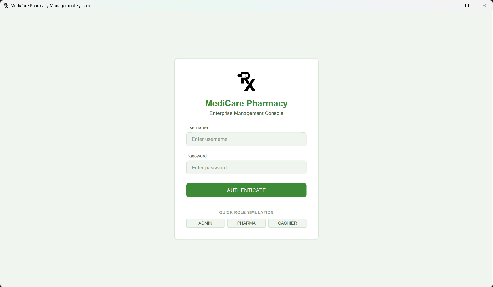</td>
    <td align="center"><b></b><br></td>
  </tr>
  <tr>
    <td align="center"><b></b><br>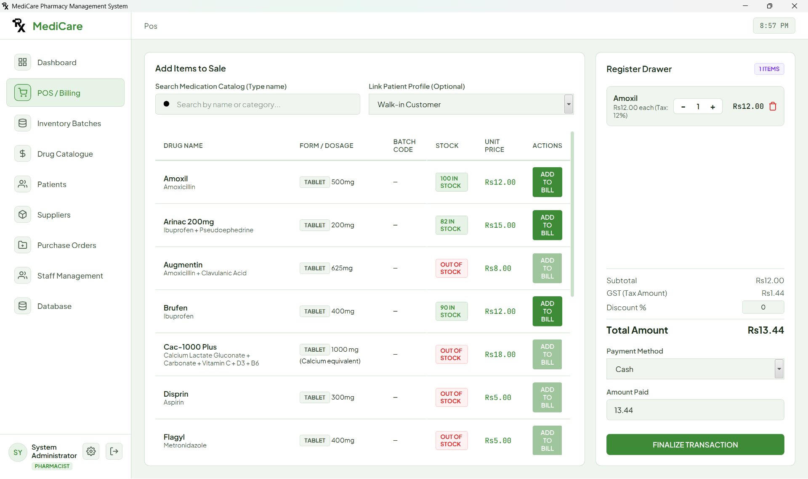</td>
    <td align="center"><b></b><br>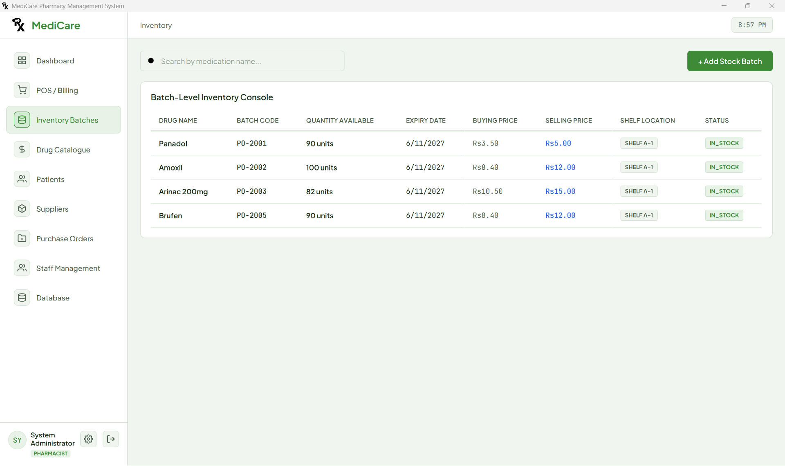</td>
  </tr>
  <tr>
    <td align="center"><b></b><br>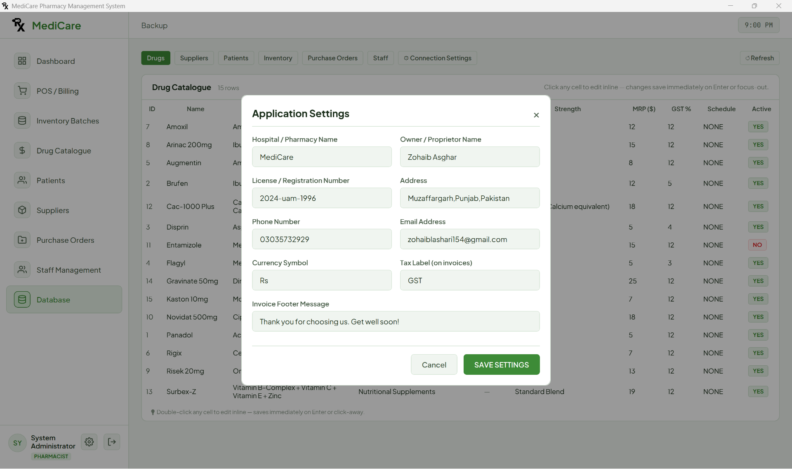</td>
    <td align="center"><b></b><br>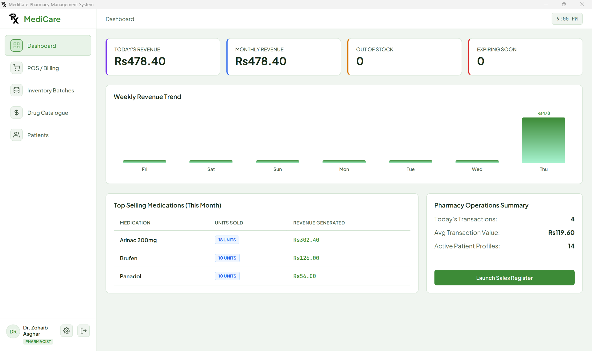</td>
   </tr>
  <tr>
    <td align="center"><b></b><br>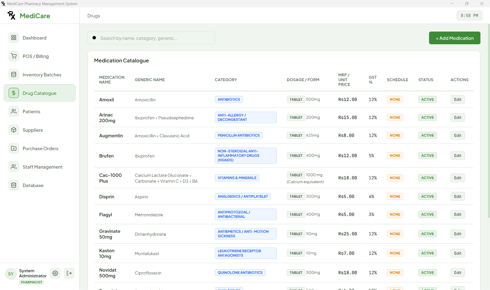</td>
    <td align="center"><b></b><br>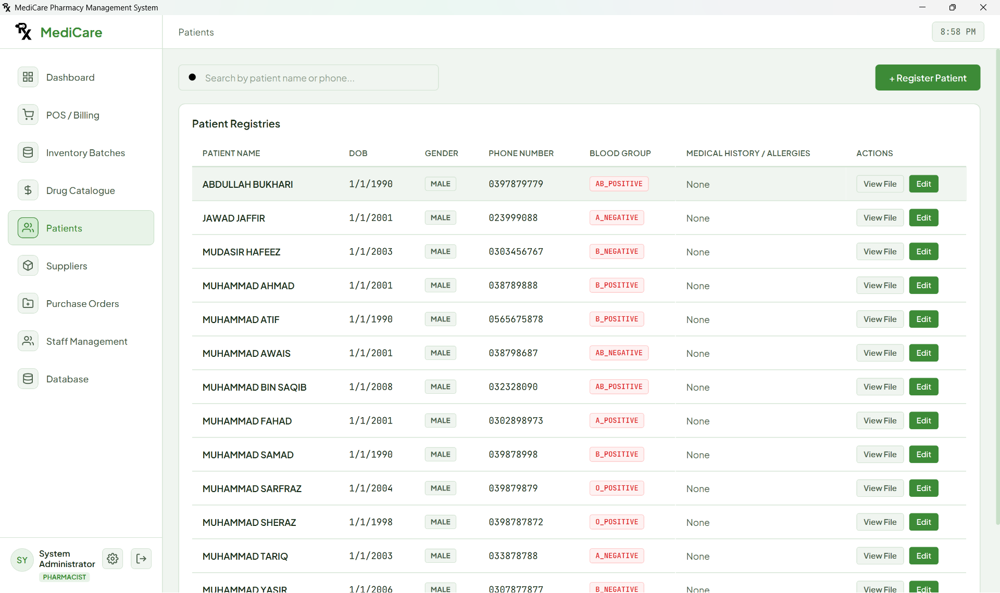</td>
  </tr>
  <tr>
    <td align="center"><b></b><br>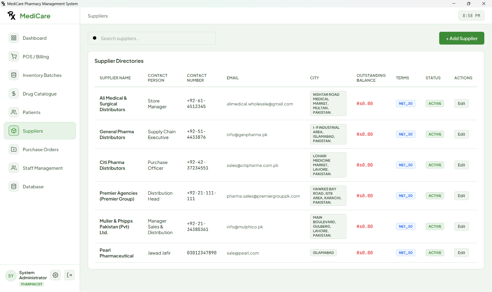</td>
    <td align="center"><b></b><br>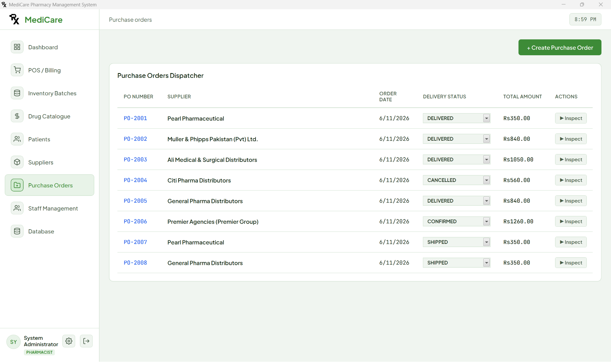</td>
   </tr>
  <tr>
    <td align="center"><b></b><br>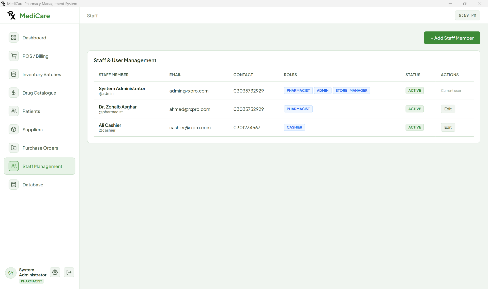</td>
    <td align="center"><b></b><br>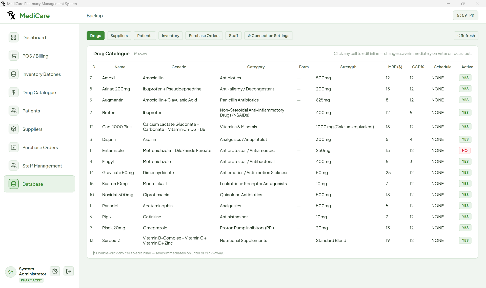</td>
  </tr>
</table>

---

## Technology Stack

| Layer | Technology |
|------|------------|
| Language | Java 17 |
| Framework | Spring Boot 3.2.5 |
| Security | Spring Security + JWT |
| ORM | Spring Data JPA / Hibernate |
| Database | MySQL / H2 |
| API Docs | SpringDoc OpenAPI |
| Desktop Layer | JavaFX 21.0.1 |
| UI | HTML, CSS, JavaScript |
| Build Tool | Maven |

---

## Main Modules

- `Auth` — login and token-based security
- `Dashboard` — summary metrics and alerts
- `Drugs` — medicine management
- `Inventory` — stock batch handling and expiry tracking
- `Patients` — patient information management
- `Prescriptions` — prescription workflow and dispensing
- `Sales` — billing and sales records
- `Suppliers` — supplier and purchase order management

---

## Folder Structure

```text
pharmacy-system/
├── pom.xml
├── README.md
├── src/
│   ├── main/
│   │   ├── java/com/medicare/
│   │   └── resources/
│   └── test/
├── docs/submission-images/
└── run.bat
```

---

## How to Run

### Build the project

```bash
mvn clean package -DskipTests
```

### Build the Windows desktop app image

```powershell
.\build-dist.ps1
```

This produces the packaged desktop application under `target\dist\MediCare\` and also prepares the launcher files used by the Windows build.

### Build the Windows installer with Inno Setup

The project includes an Inno Setup script at `medicare_setup.iss` for creating a proper Windows installer.

1. Install **Inno Setup 6** on Windows.
2. Open `medicare_setup.iss` in the Inno Setup Compiler.
3. Click **Compile**.
4. The installer output is written to the location configured in the script.

The installer package includes the launcher, JavaFX runtime files, source/resources used by the app, and the setup wizard branding images.

### Run tests

```bash
mvn test
```

### Windows launch options

```bat
run.bat
```

or

```bat
Launch-MediCare.bat
```

If you want a distribution-style Windows install experience, use the Inno Setup installer instead of launching the app directly.

---

## Database Support

- **MySQL** is the primary database option
- **H2** is available for local development and testing

The app is configured to support database-backed pharmacy workflows such as inventory, billing, and user authentication.

---

## Core Features

- login with JWT security
- role-based permissions
- pharmacy stock management
- medicine and supplier records
- sales and invoice handling
- prescription tracking
- desktop UI for local use
- should work on deb but not tested

---
## About Me

- My name is Zohaib Asghar
- If You are Here Give a Star😊
